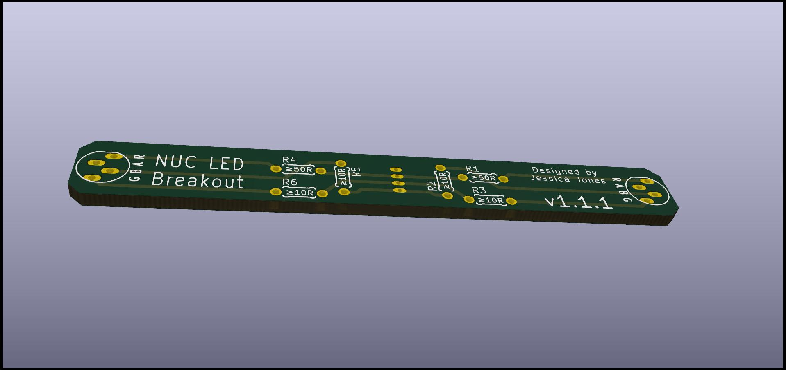

# NUC 10 RGB Header Breadkout Board

The [nuc10_rgb_breakout_v1.1.1.zip](nuc10_rgb_breakout_v1.1.1.zip) provides an example breakout board schematic for use with KiCad
allowing one to use the internal RGB header available on the NUC 10. This has been tested to work the NUC WMI kernel module
and NUC WMI CLI Python userland.

## License

[Creative Commons Attribution-ShareAlike 4.0 International (CC BY-SA 4.0)](https://creativecommons.org/licenses/by-sa/4.0/)

## Author

Jess Jones \<jess AT tvisioninsights DOT com>
